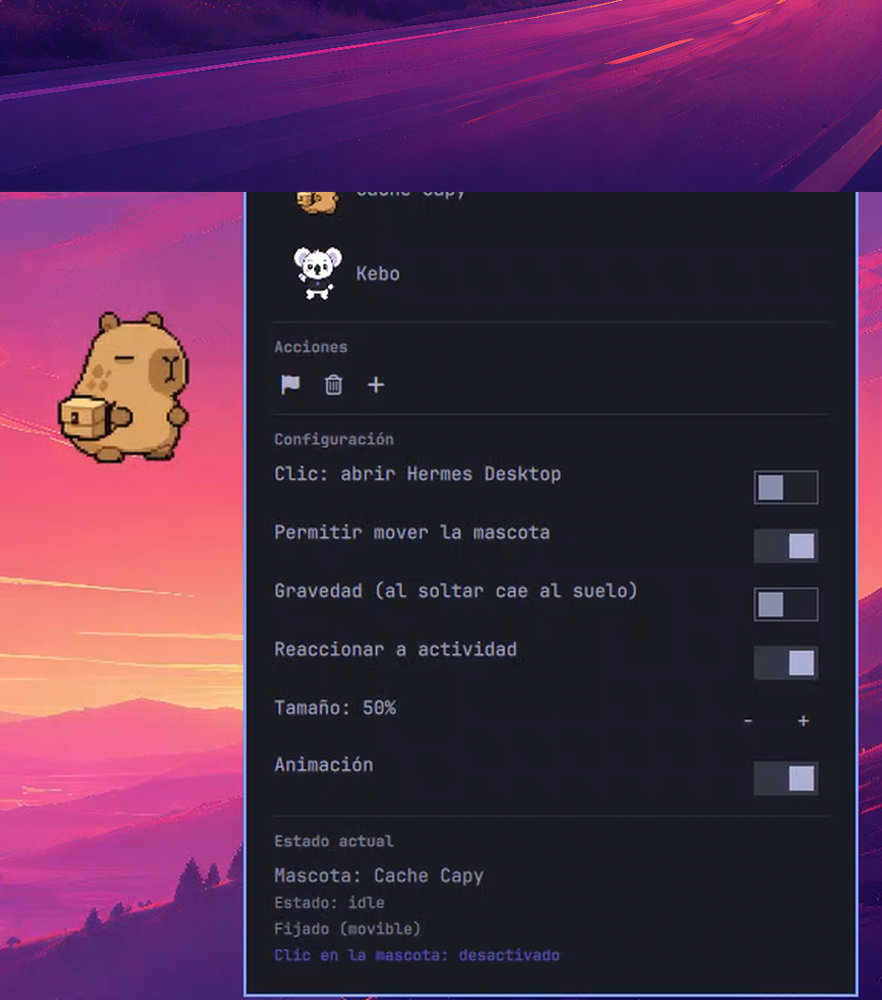

# Hermes Pets



Un acompañante animado tipo mascota para la barra de Omarchy. Reproduce las
hojas de sprite del petdex de Hermes, mira el cursor,
saluda cuando lo clickeas y puede fijarse al escritorio. Basado en
[Omarchy Pets](https://plugins.omarchy.org/plugin.html?id=raiden-meixelysia.omarchy-pets),
adaptado para leer los pets de Hermes en lugar de los de Codex.

## Características

- Lee las mascotas instaladas en tu petdex de Hermes.
- Reproduce las animaciones del atlas (idle, waving, jumping, waiting, running,
  y filas direccionales de caminar si la hoja las trae).
- El sprite mira el cursor (hojas v2 con filas de look).
- Clic = saludo; si está fijada, el clic puede abrir Hermes Desktop
  (configurable).
- Pinned mode: la mascota flota sobre el escritorio con el panel cerrado; se
  puede arrastrar y se recuerda la posición.
- Desplazamiento con Alt mientras pasa sobre la mascota fijada: cambia su
  tamaño.
- Roaming: la mascota pausa unos segundos y camina sola por el borde inferior.
- (Opcional) Espejo de actividad: la mascota refleja el estado del agente
  Hermes (`idle`, `run`, `review`, `wave`, `jump`, `failed`, `waiting`).

## Requisitos

- Omarchy con su barra Quickshell (`omarchy-shell`) sobre Hyprland.
- Al menos una mascota instalada en Hermes:
  `hermes pets install <slug>`.
  La carpeta de la mascota debe contener `pet.json` y el spritesheet
  (WebP o PNG, atlas 1536×N*208, 192×208 por frame).
  Formato de los pets: https://petdex.dev

## Instalar

```sh
git clone https://github.com/madmasx/hermes-pets-omarchy.git
omarchy plugin add ./hermes-pets-omarchy --enable
```

El botón de la barra muestra el primer frame de la mascota activa; sin mascotas
instaladas muestra una pata.

## Uso

- Clic en el icono de la barra: abre el panel (mascota animada, lista de
  mascotas instaladas y ajustes). Escape o clic fuera lo cierra.
- Clic en una mascota de la lista: la activa. La elección sobrevive a
  reinicios.
- Botón pin: fija la mascota al escritorio con el panel cerrado. No toma foco
  de teclado; la mascota es lo único clickeable.
- Mascota fijada: arrástrala para moverla (la posición se recuerda) o haz clic
  para abrir Hermes Desktop (si `launchOnClick` está activo).
- Clic en el icono de la barra mientras está fijada = la desfija.
- Alt + rueda sobre la mascota fijada: escala.

## Configuración

Los ajustes se cambian desde el panel o por CLI:

```sh
omarchy bar set madmasx.hermes-pets smooth false --json
```

| Clave | Tipo | Default | Significado |
|---|---|---|---|
| `petId` | string | `""` | Nombre de la mascota activa; vacío = la primera instalada |
| `petsDir` | string | `~/.hermes/pets` | Dónde leer el petdex de Hermes |
| `smooth` | bool | `true` | Escalado bilineal; apagar para pixel art |
| `pinned` | bool | `false` | Dejar la mascota en el escritorio |
| `pinnedX`/`pinnedY` | int | `-1` | Posición de la mascota fijada; `-1` = bajo su icono de barra. El arrastre los setea |
| `movable` | bool | `true` | Permitir arrastrar la mascota fijada |
| `petScale` | number | `0.75` | Factor de escala (0.25 a 3.0) |
| `gravityEnabled` | bool | `true` | Si sueltas la mascota en el aire, cae al suelo |
| `randomBehavior` | bool | `true` | Roaming: pausa y camina a una X aleatoria por el borde inferior |
| `animate` | bool | `true` | Apagado: muestra un frame quieto y no corre el timer |
| `launchOnClick` | bool | `true` | Clic en la mascota fijada: abre Hermes Desktop |
| `activityEnabled` | bool | `false` | Refleja el estado del agente Hermes (ver abajo) |

## Roaming

La mascota deambula en lugar de quedarse clavada: pausa 8-20 s, elige un destino
aleatorio en el borde inferior y camina hacia él con la fila direccional
correspondiente (`running-right`/`running-left`, o `running` en espejo si el
atlas no las trae). La velocidad se deriva de la duración del loop de la
animación (una longitud de cuerpo por loop) para que los pasos se lean como
pasos y no como un deslizamiento. Al terminar cada tramo se persiste la X.

Se detiene mientras arrastras la mascota, mientras cae por gravedad y mientras
el agente Hermes esté activo (`run`/`review`/`waiting`), que es cuando Hermes
también solo deambula con el agente en reposo.

## Espejo de actividad (activityEnabled)

Cuando `activityEnabled` está activo, la mascota refleja en vivo lo que hace el
agente Hermes. El estado (`agent.pet.state.derive_pet_state`) se calcula en
proceso y **no se persiste**, así que un plugin de Hermes lo escribe a disco y
este plugin de Omarchy lo lee.

### Plugin de Hermes (productor)

El plugin se suscribe a los hooks del ciclo de vida
(`pre/post_llm_call`, `pre/post_api_request`, `api_request_error`,
`pre/post_tool_call`, `pre/post_approval_response`, `pre_verify`,
`agent_loop_stopped`, `subagent_stop`, `on_session_start/end/finalize`),
deriva la pose canónica con `derive_pet_state` y la escribe de forma atómica
en un archivo de estado.

Su fuente versionada vive en [`hermes-plugin/`](hermes-plugin/) de este repo.
Instalarlo y habilitarlo (una sola vez):

```sh
mkdir -p ~/.hermes/plugins/pet-activity
cp hermes-plugin/__init__.py hermes-plugin/plugin.yaml ~/.hermes/plugins/pet-activity/
hermes plugins enable pet-activity
hermes plugins doctor pet-activity   # verifica los hooks registrados
```

### Lector en Omarchy (consumidor)

Este runtime de Quickshell no expone `Qt.readFile`, así que el panel lee el
archivo de estado con un `Process` (`cat`) cada 700 ms mientras
`activityEnabled` esté activo y aplica la pose cuando cambia.

Vocabulario canónico (enum `PetState` de Hermes):
`idle`, `run`, `review`, `wave`, `jump`, `failed`, `waiting`.

- `run`, `review`, `waiting` se **sostienen** mientras Hermes siga en ese estado.
- `wave`, `jump`, `failed` son beats de un solo pase; se ignoran transitorios
  con `updated_at` de más de 3 s.

El panel también acepta los nombres de sprite del atlas (`idle`, `waving`,
`jumping`, `waiting`, `running`) además de los canónicos.

## Desarrollar

```sh
# Validar la estructura (desde la raíz del repo)
omarchy plugin validate .

# Lint QML (si qmllint está disponible)
qmllint -I "$(omarchy shell path)/shell" *.qml

# Reiniciar el shell para recargar
omarchy restart shell
```

Guardar un archivo bajo `~/.config/omarchy/plugins/` recarga el plugin
automáticamente; no hace falta reiniciar salvo para `manifest.json`.

## Quitar

```sh
omarchy plugin remove madmasx.hermes-pets
```

Esto borra la carpeta del plugin (con backup). La línea de ajustes en la
configuración de la barra queda; límpiala a mano si quieres. Las mascotas del
petdex no se tocan.

## Créditos

- **Madmasx** — creador del plugin.
- **Opencode** — asistente de desarrollo ([opencode](https://github.com/anomalyco/opencode)).
- **Hermes** — el agente que da vida a la mascota.

Las mascotas son assets de terceros, no forman parte de este repo y cada una
conserva su propia licencia.

## Licencia

MIT — ver LICENSE.